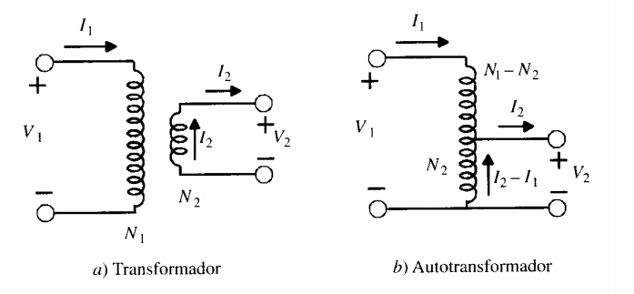

# Autotransformador
	Es un transformador especial formado por un devanado continuo, que se utiliza a la vez como 
primario y secundario, por lo que las tensiones de alimentación y salida no van aisladas entre si.

En el transformador reductor, la bobina del lado de alta tensión está compuesta por la bobina serie y la bobina común. La bobina del lado de baja tensión es la bobina común.

**V~H~** = Voltaje lado de alto

**I~H~** = Corriente lado de alto

**N~SE~** = Numero de vueltas bobina secundaria

**N~C~** = Numero de vueltas bobina común

**I~SE~** = Corriente de bonina secundaria

**I~C~** = Corriente bobina común

**V~L~** = Voltaje lado de bajo
 
**I~L~** = Corriente lado de bajo
