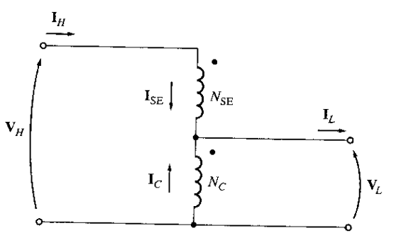

# Autotransformador
Es un transformador especial formado por un devanado continuo, que se utiliza a la vez como primario y secundario, por lo que las tensiones de alimentación y salida no van aisladas entre si.

En el transformador reductor, la bobina del lado de alta tensión está compuesta por la bobina serie y la bobina común. La bobina del lado de baja tensión es la bobina común.

**VH** = Voltaje lado de alto

**IH** = Corriente lado de alto

**NSE** = Numero de vueltas bobina secundaria

**NC** = Numero de vueltas bobina común

**ISE** = Corriente de bonina secundaria

**IC** = Corriente bobina común

**VL** = Voltaje lado de bajo
 
**IL** = Corriente lado de bajo
