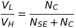
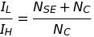
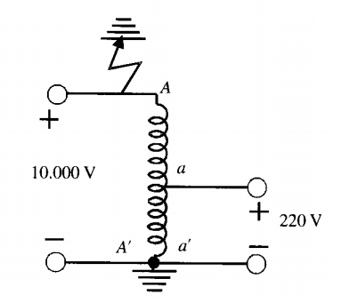
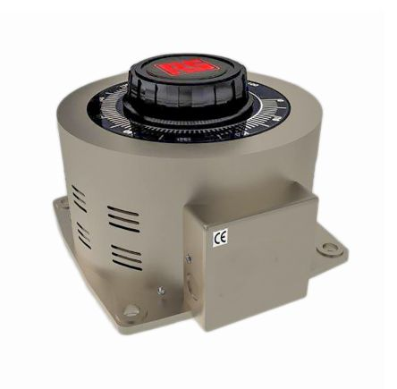

# Autotransformador
Es un transformador especial formado por un devanado continuo, que se utiliza a la vez como primario y secundario, por lo que las tensiones de alimentación y salida no van aisladas entre si.

En el transformador reductor, la bobina del lado de alta tensión está compuesta por la bobina serie y la bobina común. La bobina del lado de baja tensión es la bobina común.

**VH** = Voltaje lado de alto

**IH** = Corriente lado de alto

_N_SE = Numero de vueltas bobina secundaria

_N_C = Numero de vueltas bobina común

**ISE** = Corriente de bonina secundaria

**IC** = Corriente bobina común

**VL** = Voltaje lado de bajo
 
**IL** = Corriente lado de bajo

* La relación de voltajes entre los dos lados de un autotransformador es:

  

* La relación de corrientes entre los dos lados de un autotransformador es:

## Ventajas: 
+ Hay ahorro de material en un autotransformador frente al transformador: la reducción del numero de espiras permite emplear circuitos magnéticos más chicos lo que reduce el peso en hierro.

+ Menos perdidas en el cobre y en el hierro, lo que mejora el rendimiento y la caída de tensión frente al transformador.

## Desventajas:

+ Por su menor resistencia y reactancia, en caso de unión accidental de los bornes del devanado secundario (falla de cortocircuito), por este aparece una elevada corriente en el secundario, muy peligrosa para la vida de la maquina por sus fuertes efectos térmicos

+ Si la relación de transformación es muy elevada, por ejemplo 10000/220 V, tiene el inconveniente de presentar un borne común a los arrollamientos de AT y BT (A´ =a´)

## Ejemplo

  **Variac**

